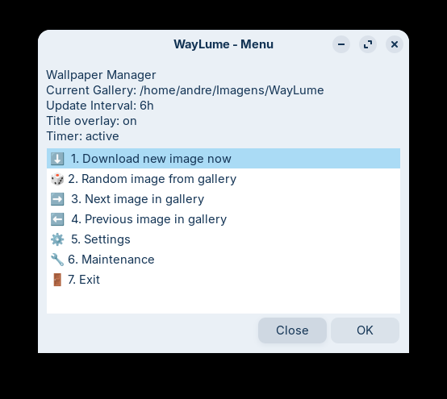
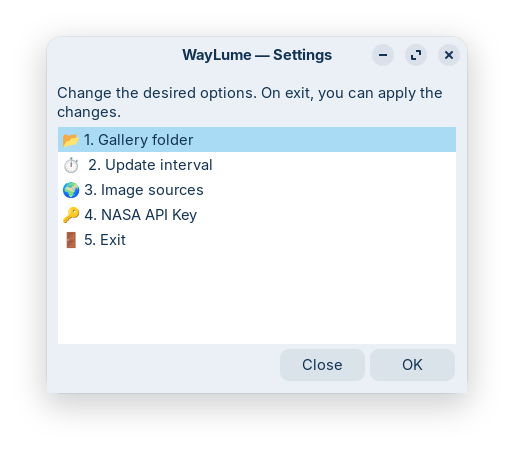
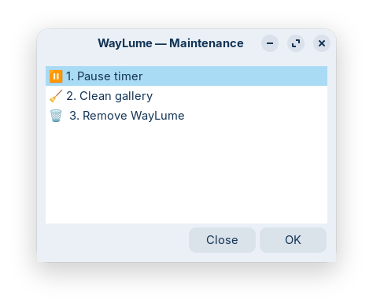

#  WayLume

🌐 **Language / Idioma:** [🇧🇷 Português](README.pt.md) · 🇺🇸 English (current)

WayLume is a minimalist, self-contained, zero-background-resource wallpaper manager designed specifically for Wayland environments (currently focused on **GNOME**).

It was created to fill the gap left by tools like Variety, which face stability issues under Wayland, opting for a robust architecture based on **Systemd Timers** and native scripts instead of persistent daemons.

## ✨ Highlights

* **Zero Resource Usage:** Doesn't run in the background. The GUI opens only when you want to configure. Systemd handles the scheduling.
* **Daemon-Agnostic:** Once the window is closed, WayLume consumes no RAM.
* **Four Image Sources:** Bing (Photo of the Day), NASA APOD (Astronomy Picture of the Day), Unsplash, and Wikimedia Picture of the Day — choose one or more.
* **One Download Per Source Per Day:** Every source is capped at one new image per day. On subsequent timer runs, WayLume automatically rotates through the local gallery — no bandwidth waste.
* **Gallery Size Limit:** Configurable maximum number of images kept on disk (default: 60). Oldest images are pruned automatically after each download.
* **Overlaid Title:** When available, the image title and the **WayLume** name are rendered directly onto the wallpaper via ImageMagick. The overlay can be toggled on or off in Settings (default: on).
* **Resilience:** The Systemd Timer with `Persistent=true` ensures missed runs (PC off) are caught up on login.
* **Clean Uninstall:** Removes timers, scripts, and config without deleting your photo gallery.
* **Single-File Distribution:** `waylume.sh` is self-contained — installer, configurator (GUI), service generator, and uninstaller, all in one script.

## 🛠️ Prerequisites

The script will attempt to install missing prerequisites on first run (requires `sudo`). Required packages:

* `yad` — graphical interface (dialogs)
* `curl` — image downloading
* `libnotify` / `notify-send` — system notifications
* `file` — MIME type validation of downloaded images
* `imagemagick` *(optional)* — title overlay on the wallpaper

## 🚀 Installation & Usage

WayLume installs everything inside the user's home (`~/.local/...`), no `sudo` needed after dependency installation.

```bash
git clone https://github.com/andrecavalcantebr/waylume.git
cd waylume
chmod +x waylume.sh
./waylume.sh
```

The script will detect it isn't installed and offer to auto-install. From there, close the terminal — WayLume will appear in the system application menu (search "WayLume").

To install directly without the interactive prompt:

```bash
./waylume.sh --install
```

## 🗑️ Uninstall

Your photo gallery is **never deleted** by either procedure below. Only WayLume files (scripts, timer, icon, menu entry, and configuration) are removed.

### Via the graphical interface

1. Open WayLume from the application menu
2. Select **🔧 Maintenance**
3. Select **🗑️ Remove WayLume**
4. Confirm in the warning dialog

### Via the terminal (CLI)

If WayLume is already installed in `~/.local/bin`:

```bash
waylume --uninstall
```

Or, from the source folder:

```bash
./waylume.sh --uninstall
```

A confirmation dialog will be shown before anything is removed.

> **What is removed:** scripts (`~/.local/bin/waylume*`), systemd timer and service, icon, menu entry, and the configuration directory (`~/.config/waylume/`). Your image gallery is left untouched.

## 📖 User Manual

### Main Menu



| Option | What it does |
| --- | --- |
| ⬇️ Download new image now | Downloads a new image from the internet and sets it as wallpaper |
| 🎲 Random image from gallery | Picks a random image already in the local gallery (instant, no download) |
| ➡️ Next image in gallery | Advances through the gallery (chronological order, circular) |
| ⬅️ Previous image in gallery | Goes back through the gallery (chronological order, circular) |
| ⚙️ Settings | Opens the settings submenu |
| 🔧 Maintenance | Opens the maintenance submenu |
| 🚪 Exit | Closes WayLume |

---

### Submenu: Settings



| Option | What it configures |
| --- | --- |
| 📂 Gallery folder | Directory where photos are stored |
| ⏱️ Update interval | How often the timer changes the wallpaper (minutes or hours) |
| 🌍 Image sources | **Bing** (photo of the day), **Unsplash** (random), **APOD** (NASA) and/or **Wikimedia** (picture of the day) — each downloads at most one new image per day |
| 🔑 NASA API Key | Key for the APOD API (default: `DEMO_KEY`) |
| 🖼️ Gallery limit | Maximum number of images kept on disk (0 = unlimited, default: 60) |
| 🎨 Title overlay | Enables or disables the image title and WayLume name displayed on the wallpaper (default: on) |

Obs. 1:
> **Settings flow:** Changes stay in memory until you exit the submenu. On exit (item 7 or Close button), if there are pending changes, WayLume asks whether to apply them. On confirmation, it saves and restarts the timer automatically.

Obs. 2:
> **NASA APOD tip:** The `DEMO_KEY` has a 30 req/hour limit. For continuous use, register a free key at [api.nasa.gov](https://api.nasa.gov) (limit: 1,000 req/day).

---

### Submenu: Maintenance



| Option | What it does |
| --- | --- |
| 🧹 Clean gallery | Removes corrupted files or files with an invalid MIME type from the gallery |
| 🗑️ Remove WayLume | Completely uninstalls WayLume. Your photo gallery is **not** deleted |

## 📁 Installed Files

Following the XDG standard, everything goes into the user's home:

| File | Location |
| --- | --- |
| Main script | `~/.local/bin/waylume` |
| Systemd worker | `~/.local/bin/waylume-fetch` |
| Icon | `~/.local/share/icons/hicolor/scalable/apps/waylume.svg` |
| Menu entry | `~/.local/share/applications/waylume.desktop` |
| Configuration | `~/.config/waylume/waylume.conf` |
| Download state | `~/.config/waylume/waylume.state` |
| Timer & Service | `~/.config/systemd/user/waylume.*` |
| Image gallery | `~/Pictures/WayLume` *(default, configurable)* |

## 🛠️ For Developers

See [DEVELOPER.md](DEVELOPER.md) for the full technical documentation: architecture, build system, i18n, guides for adding new sources and languages, and the architecture decision log.

## 📄 License

This project is licensed under the GNU General Public License v3.0 (GPLv3) — [see the LICENSE.md file](LICENSE.md) for details.
