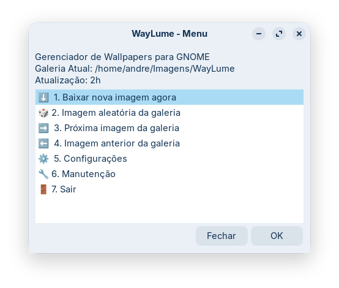
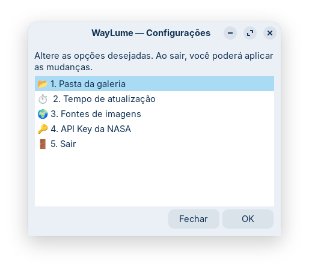
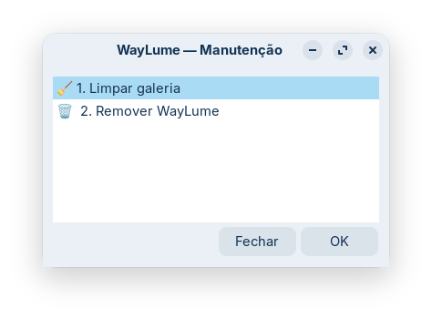

#  WayLume

🌐 **Idioma / Language:** 🇧🇷 Português (atual) · [🇺🇸 English](README.en.md)

WayLume é um gerenciador de papéis de parede minimalista, autônomo e de consumo zero de recursos em background, projetado especificamente para ambientes Wayland (atualmente focado no **GNOME**).

Ele foi criado para preencher a lacuna deixada por ferramentas como o Variety, que enfrentam problemas de estabilidade no Wayland, optando por uma arquitetura robusta baseada em **Systemd Timers** e scripts nativos em vez de daemons persistentes.

## ✨ Destaques

* **Consumo Zero:** Não roda em background. A GUI abre apenas quando você quer configurar. O Systemd cuida do agendamento.
* **Agnóstico de Daemon:** Ao fechar a janela, nenhuma RAM é consumida pelo WayLume.
* **Quatro Fontes de Imagens:** Bing (Foto do Dia), NASA APOD (Astronomy Picture of the Day), Unsplash e Wikimedia Picture of the Day — escolha uma ou mais.
* **Um Download por Fonte por Dia:** Cada fonte é limitada a uma nova imagem por dia. Nas execuções seguintes do timer, o WayLume rotaciona automaticamente pela galeria local — sem desperdício de banda.
* **Limite da Galeria:** Número máximo de imagens configurado em disco (padrão: 60). As imagens mais antigas são removidas automaticamente após cada download.
* **Título Sobreposto:** Quando disponível, o título da imagem é renderizado diretamente no wallpaper via ImageMagick (opcional).
* **Resiliência:** O Systemd Timer com `Persistent=true` garante que execuções perdidas (PC desligado) sejam recuperadas ao logar.
* **Desinstalação Limpa:** Remove timers, scripts e configurações sem apagar sua galeria de fotos.
* **Distribuição em Arquivo Único:** O `waylume.sh` é auto-suficiente — instalador, configurador (GUI), gerador de serviços e desinstalador, tudo em um script.

## 🛠️ Pré-requisitos

O script tentará instalar automaticamente os pré-requisitos na primeira execução (requer `sudo`). Os pacotes necessários são:

* `yad` — interface gráfica (diálogos)
* `curl` — download das imagens
* `libnotify` / `notify-send` — notificações do sistema
* `file` — validação do tipo MIME das imagens baixadas
* `imagemagick` *(opcional)* — sobreposição do título da imagem no wallpaper

## 🚀 Instalação e Uso

O WayLume instala tudo na home do usuário (`~/.local/...`), sem precisar de `sudo` após a instalação de dependências.

```bash
git clone https://github.com/andrecavalcantebr/waylume.git
cd waylume
chmod +x waylume.sh
./waylume.sh
```

O script detectará que não está instalado e oferecerá a auto-instalação. A partir daí, feche o terminal — o WayLume aparecerá no menu de aplicativos do sistema (busque por "WayLume").

Para instalar diretamente sem a pergunta interativa:

```bash
./waylume.sh --install
```

## 📖 Mini-manual de uso

### Menu Principal



| Opção | O que faz |
| --- | --- |
| ⬇️ Baixar nova imagem agora | Baixa agora uma imagem da internet e aplica como wallpaper |
| 🎲 Imagem aleatória da galeria | Escolhe uma imagem já na galeria local (instantaneamente, sem download) |
| ➡️ Próxima imagem da galeria | Avança na galeria (ordem cronológica, circular) |
| ⬅️ Imagem anterior da galeria | Volta na galeria (ordem cronológica, circular) |
| ⚙️ Configurações | Abre o submenu de configurações |
| 🔧 Manutenção | Abre o submenu de manutenção |
| 🚪 Sair | Fecha o WayLume |

---

### Submenu: Configurações



| Opção | O que configura |
| --- | --- |
| 📂 Pasta da galeria | Diretório onde as fotos são armazenadas |
| ⏱️ Tempo de atualização | Com que frequência o timer troca o wallpaper (minutos ou horas) |
| 🌍 Fontes de imagens | **Bing** (foto do dia), **Unsplash** (aleatória), **APOD** (NASA) e/ou **Wikimedia** (foto do dia) — cada fonte baixa no máximo uma imagem nova por dia |
| 🔑 API Key da NASA | Chave para a API do APOD (padrão: `DEMO_KEY`) |
| 🖼️ Limite da galeria | Número máximo de imagens mantidas no disco (0 = sem limite, padrão: 60) |

Obs. 1:
> **Fluxo de configuração:** as alterações ficam em memória até o usuário sair do submenu. Ao sair (item 6 ou botão Fechar), se houver mudanças, o WayLume pergunta se deseja aplicar. Ao confirmar, salva e reinicia o timer automaticamente.

Obs. 2:
> **Dica NASA APOD:** A chave `DEMO_KEY` tem limite de 30 req/hora. Para uso contínuo, registre uma chave gratuita em [api.nasa.gov](https://api.nasa.gov) (limite: 1.000 req/dia).

---

### Submenu: Manutenção



| Opção | O que faz |
| --- | --- |
| 🧹 Limpar galeria | Remove da galeria arquivos corrompidos ou com MIME inválido |
| 🗑️ Remover WayLume | Desinstala completamente o WayLume. Sua galeria de fotos **não** é apagada |

## 📁 Arquivos Instalados

Seguindo o padrão XDG, tudo vai para a home do usuário:

| Arquivo | Local |
| --- | --- |
| Script principal | `~/.local/bin/waylume` |
| Worker do Systemd | `~/.local/bin/waylume-fetch` |
| Ícone | `~/.local/share/icons/hicolor/scalable/apps/waylume.svg` |
| Atalho do menu | `~/.local/share/applications/waylume.desktop` |
| Configuração | `~/.config/waylume/waylume.conf` |
| Estado de downloads | `~/.config/waylume/waylume.state` |
| Timer e Service | `~/.config/systemd/user/waylume.*` |
| Galeria de imagens | `~/Imagens/WayLume` *(padrão, configurável)* |

## 🛠️ Para Desenvolvedores

Consulte o arquivo [DEVELOPER.md](DEVELOPER.md) para a documentação técnica completa: arquitetura, build system, i18n, guias para adicionar novas fontes e idiomas, e o log de decisões de arquitetura.

## 📄 Licença

Este projeto está licenciado sob a GNU General Public License v3.0 (GPLv3) — [veja o arquivo LICENSE.md](LICENSE.md) para detalhes.
